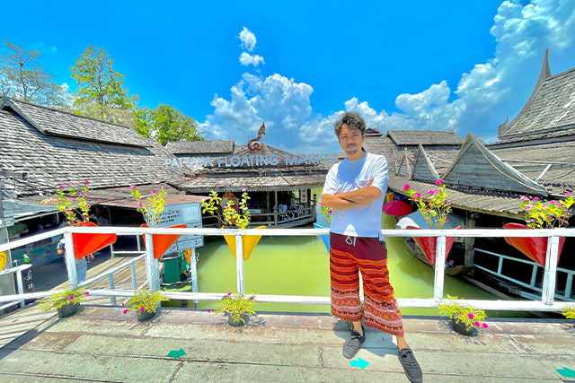

# Amazon物販コンサルLP 運用ガイド

このページは **ペライチのLPをそのまま複製した静的サイト** です。
Netlify（無料）でホスティングしています。

**公開URL:** https://musical-sundae-297597.netlify.app

---

## 📸 写真を追加する方法

### 手順

1. **追加したい画像ファイルを `images/gallery/` フォルダに入れる**
   - ファイル形式：JPG または PNG
   - ファイル名の例：`photo_new01.jpg`、`2024_event.jpg` など

2. **`index.html` を開き、ギャラリーセクションに1行追加する**
   - テキストエディタ（メモ帳、TextEdit など）で `index.html` を開く
   - Ctrl+F（Mac は Cmd+F）で「ギャラリー」を検索
   - 既存の画像タグ（下記の例）を参考に、1行コピーして貼り付ける

   **既存の画像タグの例（このままコピーしてOK）：**
   ```html
   <div class="c-img c-img--responsive u-mbmd pera1-removable"></div>
   ```

   **新しく追加する場合の例（ファイル名だけ変える）：**
   ```html
   <div class="c-img c-img--responsive u-mbmd pera1-removable"></div>
   ```

3. **保存して、Cloudflare Pages に再アップロードする**（後述の「公開手順」を参照）

---

## 🖼️ 画像サイズの目安

| 用途 | 推奨サイズ | ファイルサイズ目安 |
|------|-----------|----------------|
| ギャラリー写真 | 横800〜1200px | 200KB〜500KB 以内 |
| 背景画像 | 横1920px | 500KB 以内 |

**重くなりすぎると表示が遅くなります。**
写真を軽くしたい場合は [Squoosh](https://squoosh.app/)（無料・ブラウザで使える）がおすすめです。

---

## 🚀 公開（再デプロイ）の手順

Cloudflare Pages を使っています。変更を反映させるには以下を行います。

### 方法A：Netlify CLI でデプロイ（推奨）

ターミナルで以下を実行：

```bash
cd "/Users/shoichionizuka/Desktop/AI/ペライチ移行"
npx netlify-cli deploy --dir=site2 --prod
```

---

## 📱 LINEリンクを変更したい場合

ページ内の「LINEで応募する」ボタンのリンク先を変えたい場合：

1. `index.html` をテキストエディタで開く
2. Ctrl+F（Cmd+F）で `lin.ee/17CCHTR` を検索
3. 見つかった箇所を新しいLINEのURLに書き換える
4. 保存して再デプロイ

**現在のLINEリンク：** `https://lin.ee/17CCHTR`

---

## 📁 フォルダ構成

```
site2/
├── index.html        ← メインのページ
├── css/              ← スタイルシート（触らなくてOK）
├── js/               ← スクリプト（触らなくてOK）
└── images/
    ├── gallery/      ← ギャラリー写真（ここに追加する）
    └── （その他）    ← ロゴ・SNSアイコン等（触らなくてOK）
```

---

## ❓ 困ったときは

Claude Code などのAIに「ペライチ移行プロジェクトのREADMEを読んで」と伝えてから相談してください。
